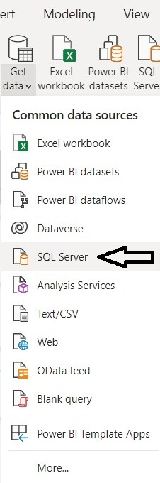
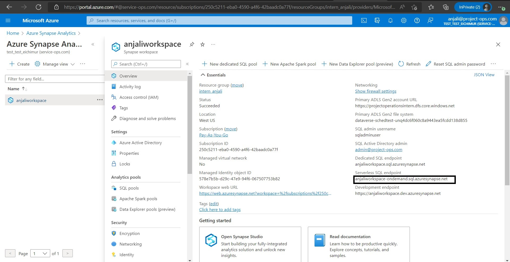

# Project Operations Dashboard

Through these Power BI reports customers will be able to visualize the data of Project Operations Application and get insights from it.

# How to use

## Prerequisites for using Export to Data Lake Service 

1) You must create and configure an Azure data lake Gen2 account.
2) We can follow the steps mentioned [here](https://docs.microsoft.com/en-us/azure/storage/common/storage-account-create?tabs=azure-portal) to create the Storage account.
3) Set your storage as Storagev2 (general purpose v2).
4) The storage account must have the Hierarchical Name Space feature enabled.
5) You must be granted an Owner role on the storage account.
6) The storage account must be created in the same Azure AD tenant as your PowerApps tenant.
7) It is recommended that the storage account is created in the same region as the PowerApps environment you plan to use it in.
8) It is recommended to set replication setting to Read-access geo-redundant storage (RA-GRS).

## Flow from Micrososft Dataverse (CDS) to Azure Data Lake Storage (ADLS)

The data flow from Microsoft Dataverse to ADLS is automatated. There are few steps we need to follow to get this working:

1) Go to Power Apps portal from [here]( https://make.powerapps.com)

2) Check that you are under the right environment.

3) Click on Dataverse in the right panel under that go to Azure Synapse Link.

4) Create an Azure Synapse Link (formerly known as Export to Data Lake) so that Dataverse can be connected with Azure Data Lake storage.

5) After creation of Azure Synapse link we will manage the tables that we want to sync from dataverse to ADLS, we will go to manage tables.

6) Now sync these tables that are shown in the image.
* If the tables are not available when you try to sync then we need to make some changes in the dataverse platform.

*  Go to dataverse platform.

* Go to Settings under that select Advanced Settings option.->Settings->Customizations 

* Now go to settings option and choose "Customizations".

* This page will be displayed now.

* Select the option "Customize the system", we will be redirected here.

* Under components that is on left side, under the entities the table that was not visible during creation of Azure Synapse Link, now enable the "Change Tracking" option.

* Now save and publish the changes through the upper ribbon on the plaform.

* Now the tables will be visible in the manage tables option and we can sync that.

## SQL SCripts in Azure Synapse Studio to create the views

Under this directory we have SQL-Scripts folder, in that many folders are there in which SQL Scripts are there.
To start with, when we will run these scripts views will be generated. We will run these scripts in Azure Synapse Studio.
* To open the Azure Synapse Studio, Go to your Synapse Workspace overview, from there you can open Synapse Studio.

1) To create the database run the query that is in Createdatabase folder in Azure Synapse Studio.
2) As the database has been created from the above step, we will create the views that are required to create the visualizations in Power BI.
3) To create the views run the SQL Scripts that are present in Common, Health and Product directory and from the scripts replace the dataverse by your dataverse. 
4) if you want to drop all the views then you can use Teardown directory and run the script that is present in it.

## Connection between Power BI and Serverless SQL Database

1) Download the Power BI report from [here](../Project-Operations-Dashboard/Project%20Operations%20Dashboard.pbix)
2) Connect it with your Data source by selecting "Get Data" option.
3) Choose the SQL server option.

4) Now enter the Server by copying Serverless SQL Endpoint Link from Synapse Workspace.

5) Now enter it here and choose the Direct Query Option.

6)Now select all the views under your created database.

7) Now your Power BI report is ready with the data that is coming from your dataverse platform.

* The Health visualization will look like this, which will represent data related to all the projects.

* If we want to know more about any particular project or want to get information about it, we can use drill through option in Power BI which can be utilized by right clicking that particular project.

* Now we can see visualizations like this.

